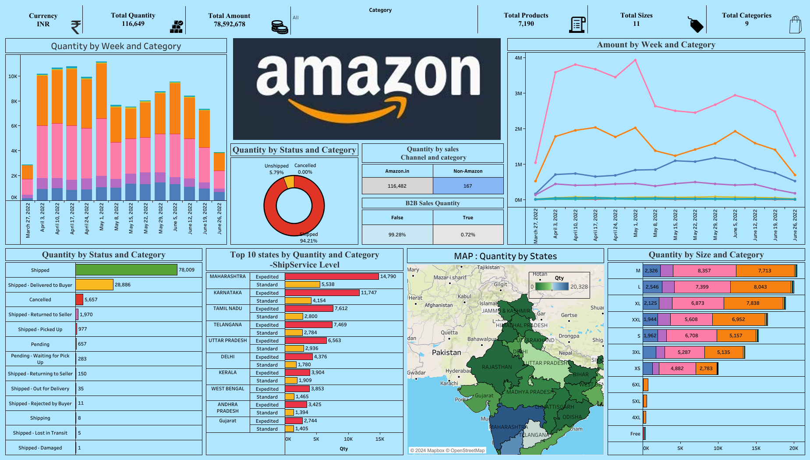

# Amazon Sales Dashboard

This repository contains a Tableau dashboard that analyzes Amazon sales data in India.

## Description

The Amazon Sales Dashboard provides insights into the sales performance of various clothing categories on Amazon in India. The dashboard helps in understanding sales trends, identifying top-performing categories, and comparing sales performance across different time periods.

## Features

- **Category Analysis**: Sales data analysis for 9 different clothing categories.
- **Time Comparison**: Weekly and annual sales performance comparison.
- **Geographical Insights**: Sales patterns analysis in relation to the top 10 states in India.

## Dashboard Preview

## Data Source

The sales data used in this dashboard is sourced from Amazon's sales records. The data includes information on sales performance across different clothing categories and states in India.

## Project Structure

- `Amazon_Sales_Dashboard.twbx`: The Tableau packaged workbook file containing the dashboard.
- `README.md`: This file providing an overview of the project.
- `path_to_dashboard_image.png`: An optional image file showing a preview of the dashboard.

## Acknowledgements

- Thanks to Amazon for providing the sales data used in this dashboard.
- Special thanks to the Tableau community for their support and resources.
